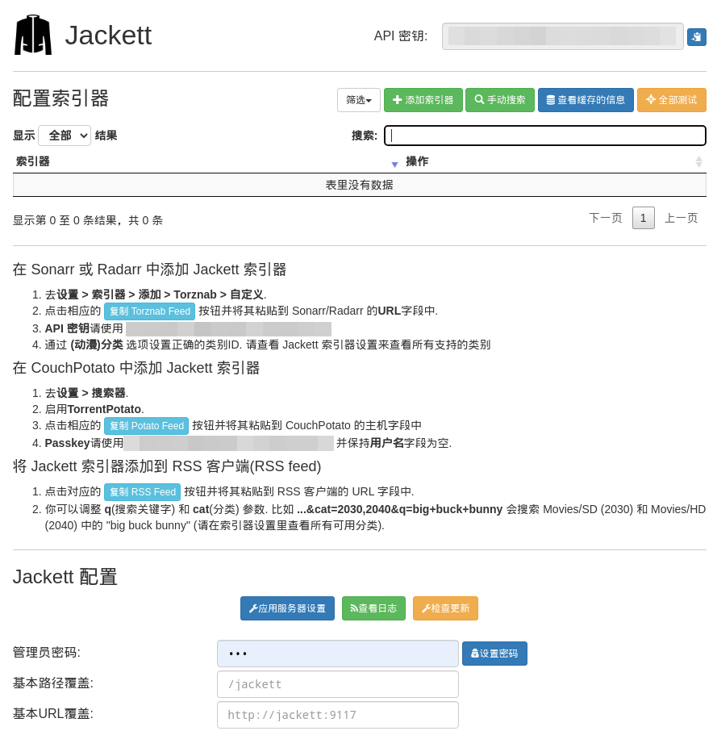
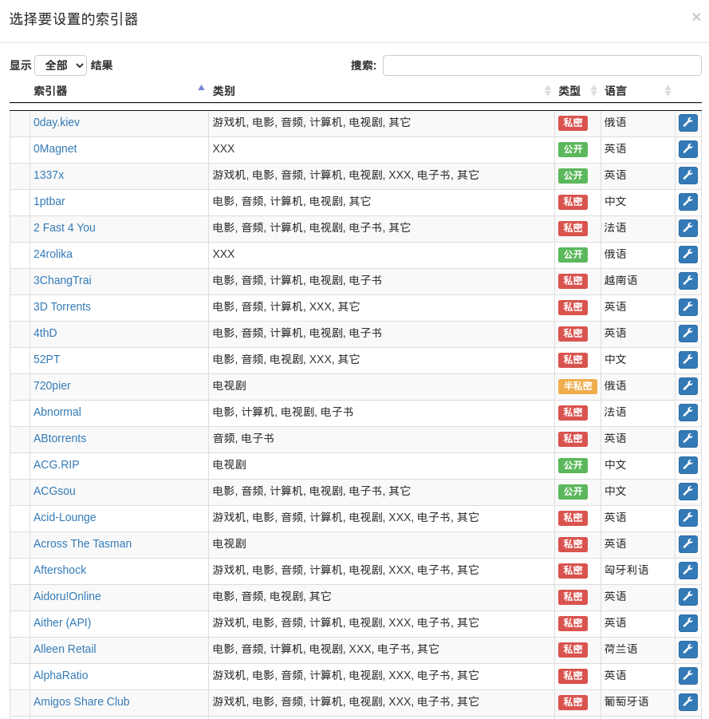

# jackett-cn

jackett 汉化

# 截图

主界面

索引器搜索

# 食用方法

1. 下载[原版](https://github.com/Jackett/Jackett/releases)
2. 下载[汉化包 jackett-cn-patch.zip](https://github.com/Nriver/jackett-translation/releases), 解压覆盖原版对应的目录

# 翻译打包流程

1. init.py
2. trans.py
3. make_release.py

# 翻译

## 静态文件

在源码这个目录下 /Jackett/src/Jackett.Common/Content/ 的Release包Content目录的页面代码

## 源码

一些文字是写死在c#代码里的, 由于没有方便的编译环境, 没有进行处理, 有想法的欢迎提pr.

